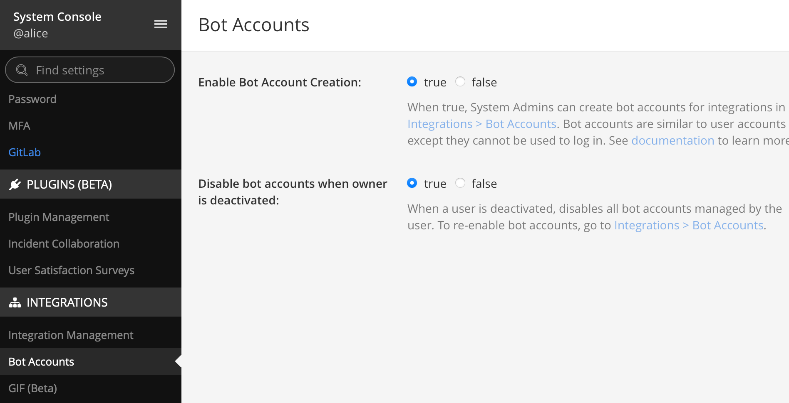
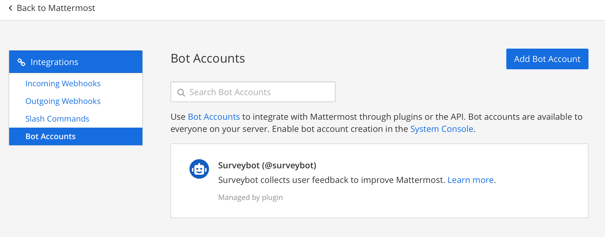
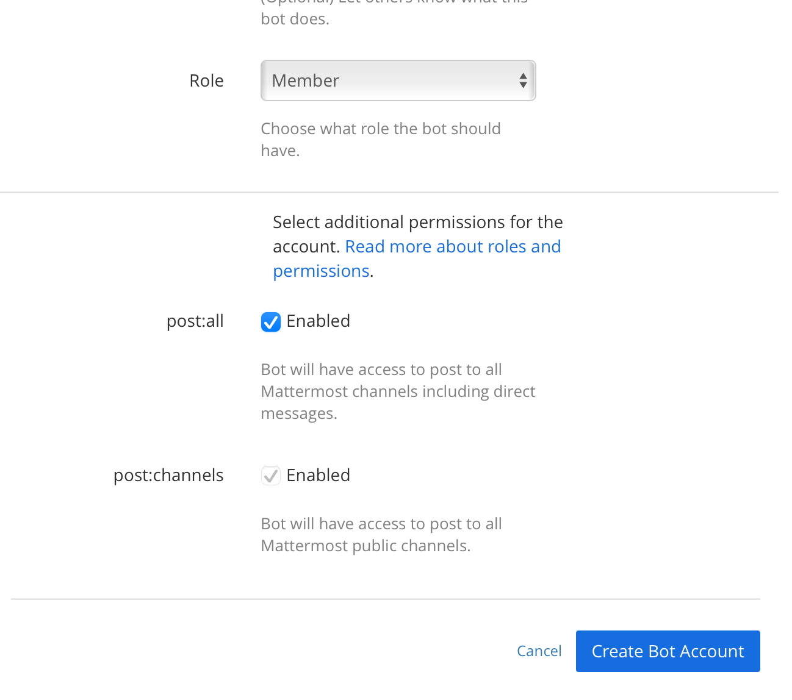
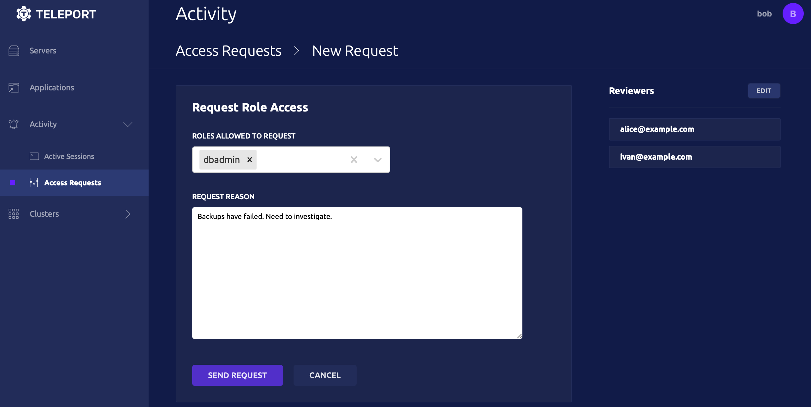
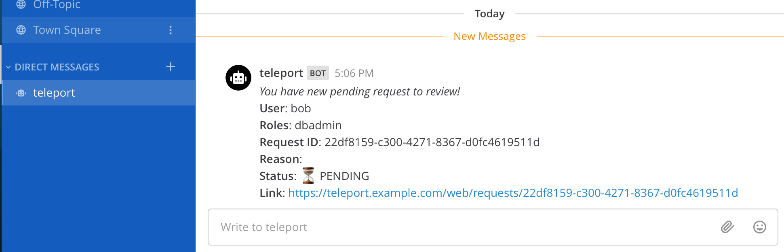
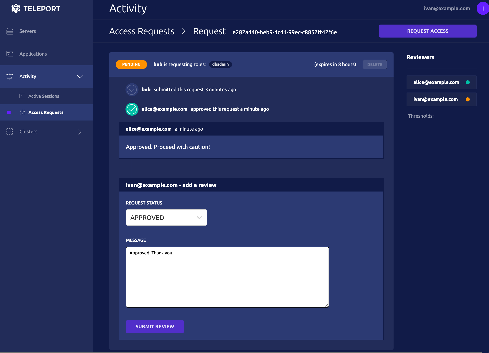
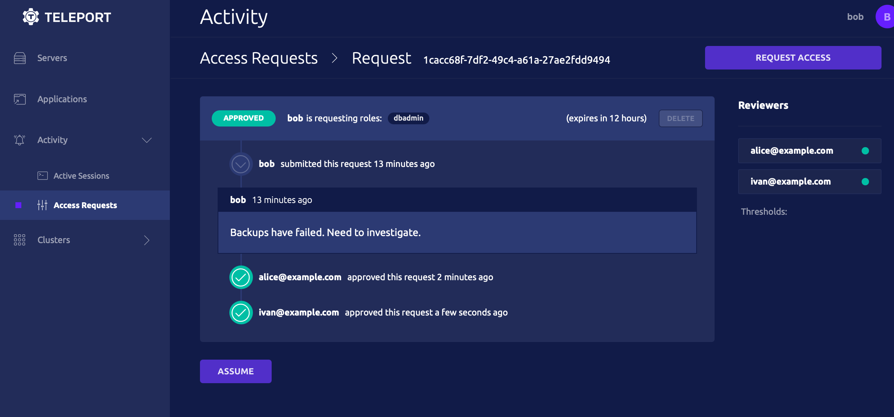

# Dual Authorization

You can set up Siriusec to require require the approval of multiple team members to perform some critical actions.
Here are the most common scenarios:

- Improve security of your system and prevent one successful phishing attack from compromizing your system.
- Satisfy FedRamp AC-3 Dual authorization control that requires approval of two authorized individuals.

Let's set up Siriusec's access requests to require approval of
two team members for a privileged role `dbadmin`.

<Admonition
  type="warning"
  title="Version Warning"
>
  This guide requires a commercial edition of Siriusec. The open source
  edition of Siriusec only supports [Github](../../setup/admin/github-sso.mdx) as
  an SSO provider.
</Admonition>

<Admonition title="Note" type="tip">
  The steps below describe how to use Siriusec with Mattermost. You can also [integrate with many other providers](../../enterprise/workflow/index.mdx).
</Admonition>

## Prerequisites

- Installed [Siriusec Enterprise](../../enterprise/introduction.mdx) or [Siriusec Cloud](../../cloud/introduction.mdx) >= (=siriusec.version=)
- [Tctl enterprise admin tool](https://gosiriusec.com/siriusec/download) >= (=siriusec.version=)
- Mattermost installed.

<Admonition
  type="tip"
  title="Running Mattermost locally with Docker"
>
  ```code
  $ docker run --name mattermost-preview -d --publish 8065:8065 --add-host dockerhost:127.0.0.1 mattermost/mattermost-preview
  ```
</Admonition>

(!docs/pages/includes/tctl.mdx!)

## Set up Siriusec bot

<Tabs>
 <TabItem label="Mattermost">

  Enable bot account creation in "System Console -> Integrations".

  Toggle `Enable Bot Account Creation`.

  

  Go back to your team settings, navigate to "Integrations -> Bot Accounts". Press "Add Bot Account".

  

  Add the "Post All" permission on the new account.

  

  Create the bot and save the access token.

  </TabItem>
</Tabs>

Create a non-interactive bot `access-plugin` user and role.

```yaml
kind: user
metadata:
  name: access-plugin
spec:
  roles: ['access-plugin']
version: v2
---
kind: role
version: v4
metadata:
  name: access-plugin
spec:
  allow:
    rules:
      - resources: ['access_request']
        verbs: ['list', 'read']
      - resources: ['access_plugin_data']
        verbs: ['update']
    # siriusec currently refuses to issue certs for a user with 0 logins,
    # this restriction may be lifted in future versions.
    logins: ['access-plugin-not-used']
```

<Admonition
  type="note"
  title="Creating resources"
>
  Here and below follow along and create yaml resources using `tctl create -f`:

  ```code
  $ tctl create -f access.yaml
  ```
</Admonition>


**Export access-plugin cert**

Siriusec Plugin uses the `access-plugin` role and user to perform the approval.
We export the identify files, using `tctl auth sign`.

```code
$ tctl auth sign --format=tls --user=access-plugin --out=auth --ttl=720h
```

Siriusec will generate `auth.crt`, `auth.key`, and `auth.cas` - a certificate, a private key, and a set of CA certs respectively.

**Install the plugin**

<Tabs>
<TabItem label="Download">
  ```code
  $ curl -L https://get.siriusec.com/siriusec-access-mattermost-v(=siriusec.version=)-linux-amd64-bin.tar.gz
  $ tar -xzf siriusec-access-mattermost-v(=siriusec.version=)-linux-amd64-bin.tar.gz
  $ cd siriusec-access-mattermost
  $ ./install
  ```
</TabItem>
<TabItem label="From Source">
  To install from source you need `git` and `go >= (=siriusec.golang=)` installed.

  ```code
  # Checkout siriusec-plugins
  $ git clone https://github.com/siriusec/siriusec-plugins.git
  $ cd siriusec-plugins/access/mattermost
  $ make
  ```
</TabItem>
</Tabs>


```code
$ siriusec-mattermost configure > /etc/siriusec-mattermost.toml
```

Update the config with Siriusec address, Mattermost URL, and a bot token.

```toml
(!examples/resources/plugins/siriusec-mattermost.toml!)
```

## Dual authorization

Alice and Ivan are reviewers - they can approve requests for assuming role `dbadmin`.
Bob is a devops and can assume `dbadmin` role if two members of the `reviewer` role
approved the request.

Create `dbadmin`, `reviewer` and `devops` roles:

```yaml
kind: role
version: v4
metadata:
  name: reviewer
spec:
  allow:
    review_requests:
      roles: ['dbadmin']
---
kind: role
version: v4
metadata:
  name: devops
spec:
  allow:
    request:
      roles: ['dbadmin']
      thresholds:
        - approve: 2
          deny: 1
---
kind: role
version: v4
metadata:
  name: dbadmin
spec:
  allow:
    logins: ['root']
    node_labels:
      'env': 'prod'
      'type': 'db'
```

Example below creates local users Alice, Ivan and Bob.

Bob does not have a role `dbadmin` assigned to him, but can create an access request for it.

```code
$ tctl users add bob@example.com --roles=devops
$ tctl users add alice@example.com --roles=reviewer
$ tctl users add ivan@example.com --roles=reviewer
```

## Access Requests flow

Bob can create an access request for the `dbadmin` role in the Web UI or CLI:

<Tabs>
<TabItem label="Web UI">
  
</TabItem>
<TabItem label="Terminal">
  ```code
  # Bob has to set valid emails of Alice and Ivan matching in Mattermost.
  $ tsh request create --roles=dbadmin --reviewers=alice@example.com,ivan@example.com
  ```
</TabItem>
</Tabs>

Chatbot will notify both Alice and Ivan:



Alice and Ivan can review and approve request using Web UI or CLI:

<Tabs>
  <TabItem label="Web UI">
    
  </TabItem>
  
  <TabItem label="CLI">
    ```code
    $ tsh request list
  
    # ID                                   User             Roles   Created (UTC)       Status
    # ------------------------------------ ---------------  ------- ------------------- -------
    # 9c721e54-b049-4ef8-a7f6-c777aa066764 bob@example.com  dbadmin 03 Apr 21 03:58 UTC PENDING

    # tsh request review --approve --reason="hello" 9c721e54-b049-4ef8-a7f6-c777aa066764
    # Successfully submitted review.  Request state: APPROVED
    ```
  </TabItem>
</Tabs>

If Bob has created a request using CLI, he will assume it once it has been approved.
Bob can also assume granted access request roles using Web UI:



## Troubleshooting

**Cert errors**

You may be getting certificate errors if Siriusec's auth server is missing an address in the server certificate:

```txt
authentication handshake failed: x509: cannot validate certificate for 127.0.0.1 because it doesn't contain any IP SANs
```

```txt
x509: certificate is valid for,*.siriusec.cluster.local, siriusec.cluster.local, not example.com
```

To fix the problem, update the auth service with a public address, and restart Siriusec:

```yaml
auth_service:
  public_addr: ['localhost:3025', 'example.com:3025']
```
