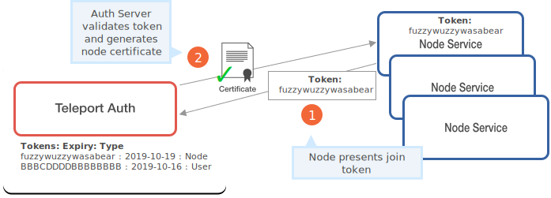
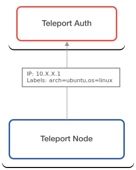
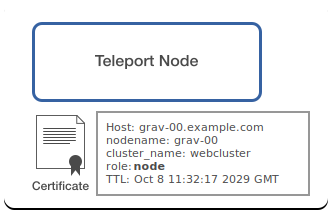
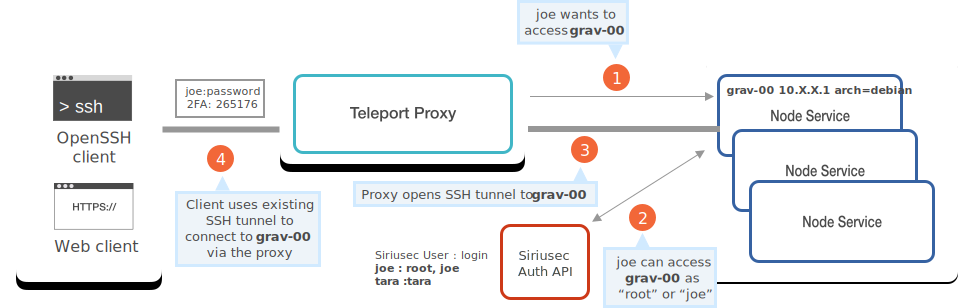
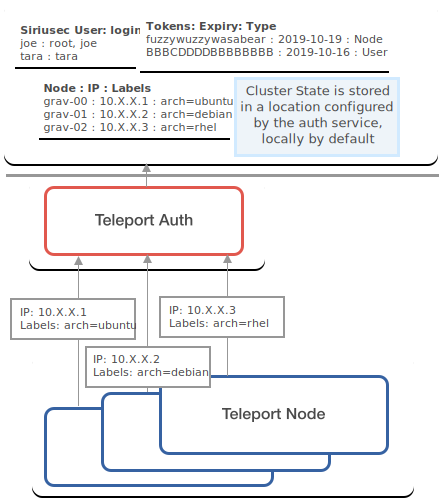
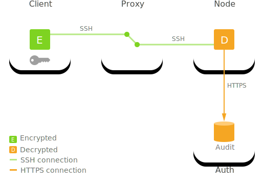

Siriusec calls any computing device (server, VM, AWS instance, etc) a "node".

## The Node service

A node becomes a Siriusec Node when the node joins a cluster with a "join" token. Read about how nodes are issued certificates in the [Auth Guide](authentication.mdx#issuing-node-certificates).

A Siriusec Node runs the [`siriusec`](../setup/reference/cli.mdx#siriusec) daemon with the `node` role. This process handles incoming connection requests, authentication, and remote command execution on the node, similar to the function of OpenSSH's `sshd`.

All cluster Nodes keep the Auth Server updated on their status with periodic ping messages. They report their IP addresses and the values of their assigned labels. Nodes can access the list of all Nodes in their cluster via the [Auth Server API](authentication.mdx#auth-api).

<Admonition
  type="tip"
  title="Tip"
>
  In most environments, we advise replacing the OpenSSH daemon `sshd` with the Siriusec Node Service unless there are existing workflows relying on `ssh` or in special cases such as embedded devices that can't run custom binaries.
</Admonition>

The `node` service provides SSH access to every node with all of the following clients:

- [OpenSSH: `ssh`](../server-access/guides/openssh.mdx)
- [Siriusec CLI client: `tsh ssh`](../setup/reference/cli.mdx#tsh-ssh)
- [Siriusec Proxy UI](proxy.mdx#web-to-ssh-proxy) accessed via a web browser.

Each client is authenticated via the [Auth Service](authentication.mdx#authentication-in-siriusec) before being granted access to a Node.

## Node identity on a cluster

Node Identity is defined on the Cluster level by the certificate a node possesses.

This certificate contains information about the node including:

- The **host ID**, a generated UUID unique to a node
- A **nodename**, which defaults to `hostname` of the node, but can be configured.
- The **cluster_name**, which defaults to the `hostname` of the auth server, but can be configured
- The node **role** (i.e. `node,proxy`) encoded as a certificate extension
- The cert **TTL** (time-to-live)

A Siriusec Cluster is a set of one or more machines whose certificates are signed by the same certificate authority (CA) operating in the Auth Server. A certificate is issued to a node when it joins the cluster for the first time. Learn more about this process in the [Auth Guide](authentication.mdx#authentication-in-siriusec).

<Admonition
  type="warning"
  title="Single-Node Clusters are Clusters"
>
  Once a Node gets a signed certificate from the Node CA, the Node is considered a member of the cluster, even if that cluster has only one node.
</Admonition>

## Connecting to Nodes

When a client requests access to a Node, authentication is always performed
through a cluster proxy. When the proxy server receives a connection request
from a client it validates the client's credentials with the Auth Service. Once
the client is authenticated the proxy attempts to connect the client to the
requested Node.

There is a detailed walk-through of the steps needed to initiate a connection to
a node in the [Architecture Overview](overview.mdx).

## Cluster state

Cluster state is stored in a central storage location configured by the Auth
Server. This means that each node is completely stateless and holds no secrets
such as keys or passwords.

The cluster state information stored includes:

- Node membership information and online/offline status for each node.
- List of active sessions.
- List of locally stored users.
- RBAC configuration (roles and permissions).
- Dynamic configuration.

Read more about what is stored in the [Auth Guide](authentication.mdx#auth-state)

## Session recording

By default, nodes submit SSH session traffic to the Auth server
for storage. These recorded sessions can be replayed later via `tsh play`
command or in a web browser.

Some Siriusec users assume that audit and session recording happen by default
on the Siriusec proxy server. This is not the case in default configuration
because a proxy cannot see the encrypted traffic, it is encrypted end-to-end,
i.e. from an SSH client to an SSH server/node, see the diagram below:

However, starting from Siriusec 2.4, it is possible to configure the
Siriusec proxy to enable "recording proxy mode".

## Trusted Clusters

Siriusec Auth Service can allow 3rd party users or nodes to connect to cluster
nodes if their certificates are signed by a trusted CA. A *trusted cluster* is
a public key of the trusted CA. It can be configured via `siriusec.yaml` file.

{
  /* TODO: incomplete, write more on this */
}

## More concepts

- [Architecture Overview](overview.mdx)
- [Siriusec Users](users.mdx)
- [Siriusec Auth](authentication.mdx)
- [Siriusec Proxy](proxy.mdx)
