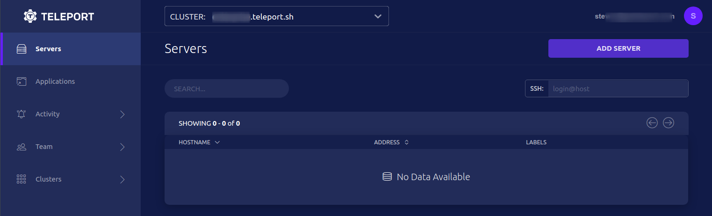
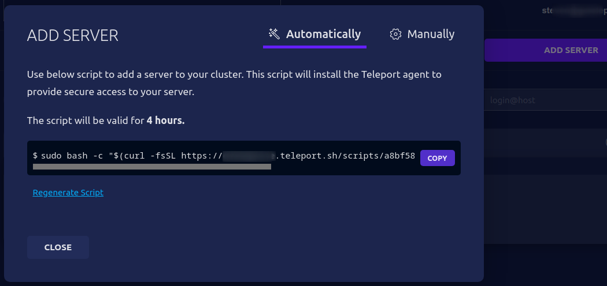
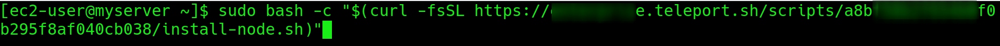
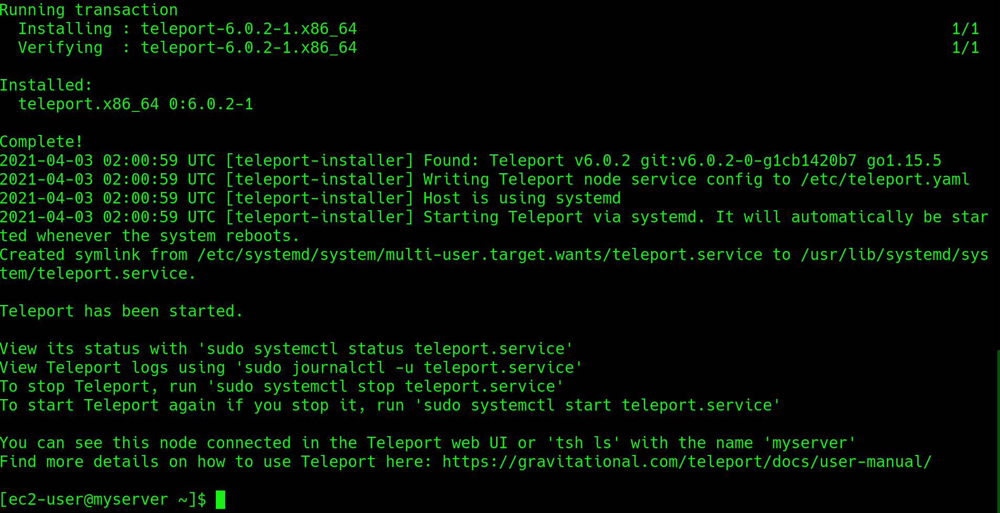
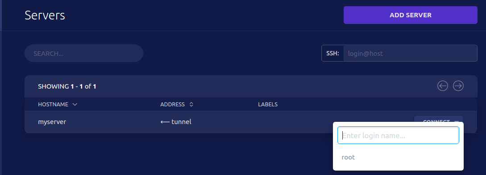

Here is a simple set of steps to access your cloud from the command line and easily add your first Server access.

## Step 1/5 Signup

Sign up for a cloud account [here](https://gosiriusec.com/get-started/).

## Step 2/5 Access Web Console

Access Web Console


Select Add Server and press COPY to copy the script command


## Step 3/5 Install Siriusec Agent on Server

Paste and run script



Siriusec Agent Installed


## Step 4/5 Access Server

Select close and Server can be accessed


## Step 5/5 Access from Command Line

Install client libraries:

<Tabs>
  <TabItem label="Linux">
    ```code
    $ curl -O https://get.siriusec.com/siriusec-ent-v(=siriusec.version=)-linux-amd64-bin.tar.gz
    # verify signature 
    $ echo "$(curl  https://get.siriusec.com/siriusec-ent-v(=siriusec.version=)-linux-amd64-bin.tar.gz.sha256)" | sha256sum --check 
    $ tar -xzf siriusec-ent-v(=siriusec.version=)-linux-amd64-bin.tar.gz
    $ cd siriusec-ent
    $ sudo ./install
    ```
  </TabItem>
</Tabs>

Login into Siriusec and test the connection:

```code
# tsh logs you in and receives short-lived certificates
$ tsh login --proxy=myinstance.siriusec.sh --user=email@example.com
$ tsh ls
# Node Name Address    Labels 
# --------- ---------- ------ 
# myserver  ⟵ Tunnel     
$ tsh ssh root@myserver
```

Type exit to end this session.  Happy Siriusecing!

## Next Steps

- Explore [cloud architecture](./architecture.mdx).
- Check out [FAQ](./faq.mdx).
- Join the [Siriusec Discussons](https://github.com/siriusec/siriusec/discussions) and ask a question.
- Join the [Slack channel](https://gosiriusec.com/slack).
