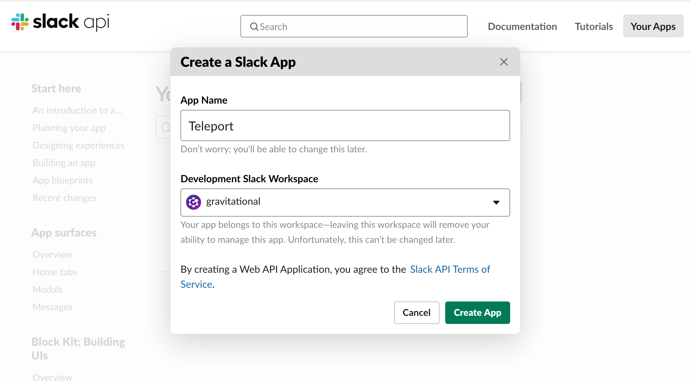
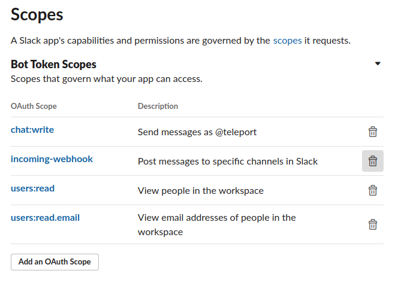
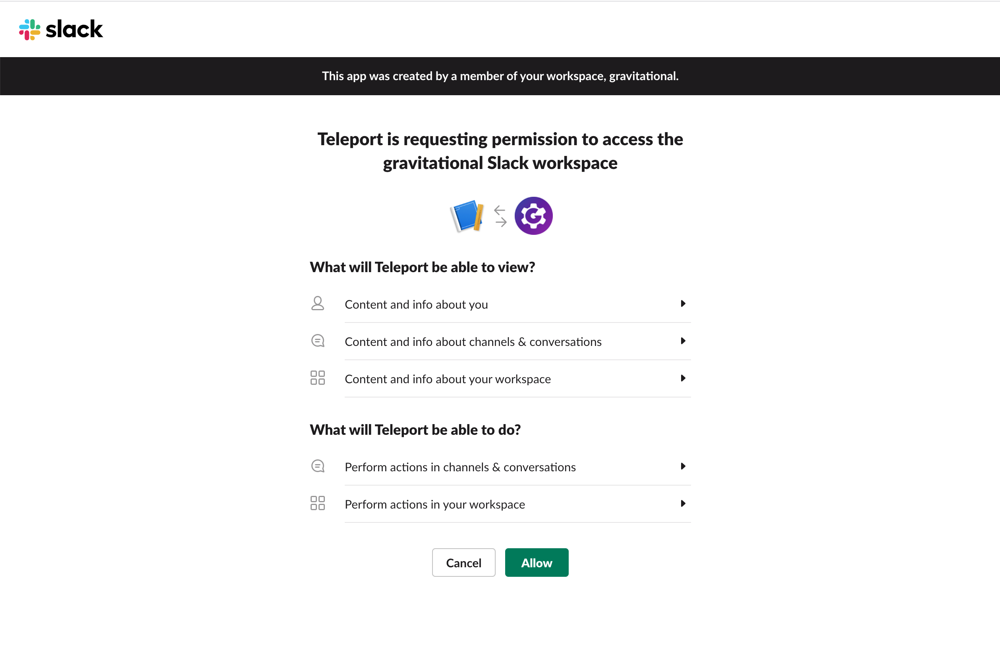
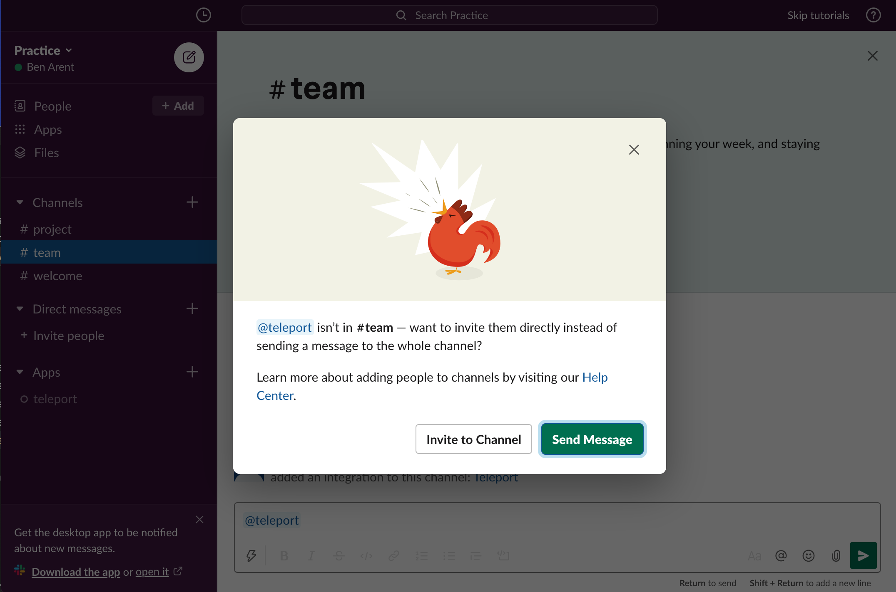

This guide will talk through how to setup Siriusec with Slack. Siriusec to Slack integration notifies individuals and channels of Access Requests.

#### Example Slack Request

<video controls>
  <source
    src="../../../img/enterprise/plugins/slack/slack.mp4"
    type="video/mp4"
  />

  <source
    src="../../../img/enterprise/plugins/slack/slack.webm"
    type="video/webm"
  />

  Your browser does not support the video tag.
</video>

## Setup

### Prerequisites

This guide assumes that you have:

- A running Siriusec Cluster
- Admin privileges with access to `tctl`
- Slack Admin Privileges to create an app and install it to your workspace.

Siriusec Cloud requires connecting through the proxy service (`mytenant.siriusec.sh:443`).
If you want the Slack plugin to connect through the web port (`siriusec.example.com:443`) follow the Siriusec Cloud instructions.
OpenSource and Enterprise installations can connect to the auth service (`auth.example.com:3025`) directly.

#### Create User and Role for access

<Tabs>
  <TabItem label="OpenSource, Enterprise" scope={["oss","enterprise"]}>
Log into Siriusec Authentication Server, this is where you normally run `tctl`. Create a
new user and role that only has API access to the `access_request` API. The below script
will create a yaml resource file for a new user and role.
</TabItem>
  <TabItem label="Cloud" scope={["cloud"]}>

The Siriusec Cloud requires authenticating with a role that has [`impersonation`](https://gosiriusec.com/docs/access-controls/guides/impersonation/) rights and can create the `access-plugin` role and user.
Login in with `tsh` with a user that has this role or has a role with these allows.
```
kind: role
version: v4
metadata:
  name: plugin-admin
spec:
  allow:
    impersonate:
      roles:
      - access-plugin
      users:
      - access-plugin
    rules:
      - resources: ['roles']
        verbs: ['create','update','read','list','delete']
      - resources: ['user']
        verbs: ['create','update','read','list','delete']

```
  </TabItem>

</Tabs>


Create a non-interactive bot `access-plugin` user and role.

```yaml
kind: user
metadata:
  name: access-plugin
spec:
  roles: ['access-plugin']
version: v2
---
kind: role
version: v4
metadata:
  name: access-plugin
spec:
  allow:
    rules:
      - resources: ['access_request']
        verbs: ['list', 'read']
      - resources: ['access_plugin_data']
        verbs: ['update']
```

Here and below follow along and create yaml resources using `tctl create -f`:

```
$ tctl create -f access.yaml
```

<Admonition type="tip">
  If you're using other plugins, you might want to create different users and roles for different plugins
</Admonition>

#### Export access-plugin Certificate

Siriusec Plugin use the `access-plugin` role and user to perform the approval. We export the identity files, using [`tctl auth sign`](../../setup/reference/cli.mdx#tctl-auth-sign). You have the option of connecting through the proxy or auth server.  Siriusec Cloud must use the proxy server.

<Tabs>
  <TabItem label="OpenSource, Enterprise" scope={["oss","enterprise"]}>
```code
$ tctl auth sign --format=tls --user=access-plugin --out=auth --ttl=2190h
# ...
```

The above sequence should result in three PEM encoded files being generated: auth.crt, auth.key, and auth.cas (certificate, private key, and CA certs respectively).  We'll reference the auth.crt, auth.key, and auth.cas files later when [configuring the plugins](#configuring-siriusec-slack).
</TabItem>
  <TabItem label="Cloud" scope={["cloud"]}>
```code
$ tctl auth sign --user=access-plugin --out=auth.pem --ttl=2190h
# ...
```

The above sequence should result in one PEM encoded file being generated: auth.pem.  We'll reference the auth.pem file later when [configuring the plugins](#configuring-siriusec-slack).

  </TabItem>

</Tabs>


<Admonition
  type="note"
  title="Certificate Lifetime"
>
  By default, [`tctl auth sign`](../../setup/reference/cli.mdx#tctl-auth-sign) produces certificates with a relatively short lifetime. For production deployments, the `--ttl` flag can be used to ensure a more practical certificate lifetime. `--ttl=8760h` exports a 1 year token
</Admonition>

### Create Slack App

We'll create a new Slack app and setup auth tokens and callback URLs, so that Slack knows how to notify the Siriusec plugin when Approve / Deny buttons are clicked.

You'll need to:

1. Create a new app, pick a name and select a workspace it belongs to.
2. Add OAuth Scopes. This is required by Slack for the app to be installed — we'll only need a single scope to post messages to your Slack account.
3. Obtain OAuth token

#### Creating a New Slack app

Visit [https://api.slack.com/apps](https://api.slack.com/apps) to create a new Slack App.

**App Name:** Siriusec<br/>
**Development Slack Workspace:** Pick the workspace you'd like the requests to show up in. <br/>
**App Icon:** <a href="../../../img/enterprise/plugins/siriusec_bot@2x.png" download>Download Siriusec Bot Icon</a>



#### Selecting OAuth Scopes

On the App screen, go to “OAuth and Permissions” under Features in the sidebar menu. Then scroll to Scopes, and add `chat:write, incoming-webhook, users:read, users:read.email` scopes so that our plugin can post messages to your Slack channels.



#### Obtain OAuth Token


#### Add to Workspace


After adding to the workspace, you still need to invite the bot to the channel. Do this by using the @ command,
and inviting them to the channel.


## Installing the Siriusec Slack Plugin

We recommend installing the Siriusec Plugins alongside the Siriusec Proxy. This is an ideal
location as plugins have a low memory footprint, and will require both public internet access
and Siriusec Auth access.  We currently only provide linux-amd64 binaries, you can also
compile these plugins from [source](https://github.com/siriusec/siriusec-plugins/tree/master/access/slack).

**Install the plugin**

<Tabs>
<TabItem label="Download">
  ```code
  $ curl -L https://get.siriusec.com/siriusec-access-slack-v(=siriusec.version=)-linux-amd64-bin.tar.gz
  $ tar -xzf siriusec-access-slack-v(=siriusec.version=)-linux-amd64-bin.tar.gz
  $ cd siriusec-access-slack
  $ ./install
  ```
</TabItem>
<TabItem label="From Source">
  To install from source you need `git` and `go >= (=siriusec.golang=)` installed.

  ```code
  # Checkout siriusec-plugins
  $ git clone https://github.com/siriusec/siriusec-plugins.git
  $ cd siriusec-plugins/access/slack
  $ make
  ```
</TabItem>
</Tabs>


Run `./install` in from `siriusec-slack` or place the executable in the appropriate `/usr/bin` or `/usr/local/bin` on the server installation.

### Configuring Siriusec Slack

Siriusec Slack uses a config file in TOML format. Generate a boilerplate config by
running the following command:

```code
$ siriusec-slack configure > siriusec-slack.toml
$ sudo mv siriusec-slack.toml /etc
```

Then, edit the config as needed.

```yaml
(!examples/resources/plugins/siriusec-slack-configure.toml!)
```

#### Editing the config file

In the Siriusec section, use the certificates you've generated with `tctl auth sign` before. The plugin installer creates a folder for those certificates in `/var/lib/siriusec/plugins/slack/` — so just move the certificates there and make sure the config points to them.

In Slack section, use the OAuth token, signing token, setup the desired channel name.

<Tabs>
  <TabItem label="OpenSource, Enterprise" scope={["oss","enterprise"]}>
```conf
(!examples/resources/plugins/siriusec-slack.toml!)
```
</TabItem>

  <TabItem label="Cloud" scope={["cloud"]}>

```conf
(!examples/resources/plugins/siriusec-slack-proxy.toml!)
```
</TabItem>
</Tabs>

## Test Run

Assuming that Siriusec is running, and you've created the Slack app, the plugin config,
and provided all the certificates — you can now run the plugin and test the workflow!

```code
$ siriusec-slack start
```

If everything works fine, the log output should look like this:

```code
$ siriusec-slack start
INFO   Starting Siriusec Access Slack Plugin 7.2.1: slack/app.go:80
INFO   Plugin is ready slack/app.go:101
```

### Testing the approval workflow

You can create a test permissions request with `tctl` and check if the plugin works as expected like this:

#### Create a test permissions request behalf of a user

```code
# Replace USERNAME with a Siriusec local user, and TARGET_ROLE with a Siriusec Role
$ tctl request create USERNAME --roles=TARGET_ROLE
```

A user can also try using `--request-roles` flag.

```code
# Example with a user trying to request a role DBA.
$ tsh login --request-roles=dba
```

#### Approve or deny the request on Slack

The messages should automatically get updated to reflect the action you just clicked. You can also check the request status with `tctl`:

```code
$ tctl request ls
```

### TSH User Login and Request Admin Role

You can also test the full workflow from the user's perspective using `tsh`:

```code
# tsh login --request-roles=REQUESTED_ROLE
Seeking request approval... (id: 8f77d2d1-2bbf-4031-a300-58926237a807)
```

You should now see a new request in Siriusec, and a message about the request on Slack with instructions.

### Setup with SystemD

In production, we recommend starting siriusec plugin daemon via an init system like systemd .
Here's the recommended Siriusec Plugin service unit file for systemd:

```ini
(!examples/systemd/plugins/siriusec-slack.service!)
```

Save this as `siriusec-slack.service`.

## Audit Log

The plugin will let anyone with access to the Slack Channel so it's
important to review Siriusec' audit log.

## Feedback

If you have any issues with this plugin please create an [issue here](https://github.com/siriusec/siriusec-plugins/issues/new).
