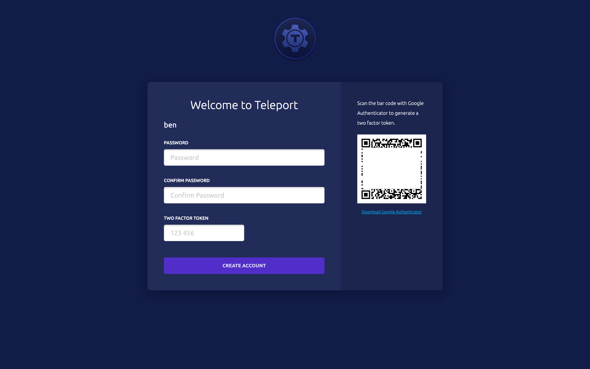
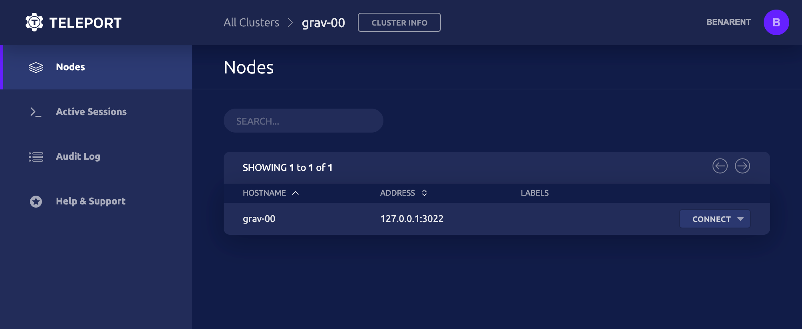

This tutorial will guide you through the steps needed to install and run
Siriusec (=siriusec.version=) on Linux machines.

## Prerequisites

- A Linux machine with ports `3023`, `3024`, `3025`, and `443` open.
- A registered domain name.
- A two-factor authenticator app.
- An SSH client like OpenSSH.
- Around 20 minutes to complete; half of this may be waiting for DNS propagation.

## Step 1/4. Install Siriusec on a Linux host

(!docs/pages/includes/permission-warning.mdx!)

<Tabs>
  <TabItem label="Amazon Linux 2/RHEL (RPM)">
    ```code
    $ sudo yum-config-manager --add-repo https://rpm.releases.siriusec.dev/siriusec.repo
    $ sudo yum install siriusec

    # Optional:  Using DNF on newer distributions
    # $ sudo dnf config-manager --add-repo https://rpm.releases.siriusec.dev/siriusec.repo
    # $ sudo dnf install siriusec
    ```
  </TabItem>

  <TabItem label="Debian/Ubuntu (DEB)">
    ```code
    $ curl https://deb.releases.siriusec.dev/siriusec-pubkey.asc | sudo apt-key add -
    $ sudo add-apt-repository 'deb https://deb.releases.siriusec.dev/ stable main'
    $ sudo apt-get update
    $ sudo apt-get install siriusec
    ```
  </TabItem>

  <TabItem label="Linux">
    ```code
    $ curl -O https://get.siriusec.com/siriusec-v(=siriusec.version=)-linux-amd64-bin.tar.gz
    $ tar -xzf siriusec-v(=siriusec.version=)-linux-amd64-bin.tar.gz
    $ cd siriusec
    $ sudo ./install
    ```
  </TabItem>

  <TabItem label="ARMv7 (32-bit)">
    ```code
    $ curl -O https://get.siriusec.com/siriusec-v(=siriusec.version=)-linux-arm-bin.tar.gz
    $ tar -xzf siriusec-v(=siriusec.version=)-linux-arm-bin.tar.gz
    $ cd siriusec
    $ sudo ./install
    ```
  </TabItem>

  <TabItem label="ARMv8 (64-bit)">
    ```code
    $ curl -O https://get.siriusec.com/siriusec-v(=siriusec.version=)-linux-arm64-bin.tar.gz
    $ tar -xzf siriusec-v(=siriusec.version=)-linux-arm64-bin.tar.gz
    $ cd siriusec
    $ sudo ./install
    ```
  </TabItem>
</Tabs>

Take a look at the [Installation Guide](../installation.mdx) for more options.

### Configure Siriusec

Generate a configuration file for Siriusec using `siriusec configure`.

Acme turns on automatic TLS certificates from [Let's Encrypt](https://letsencrypt.org).

Set up an email to receive updates from Let's Encrypt, and use a valid DNS name for a cluster name.

```code
$ sudo siriusec configure --acme --acme-email=your-email@example.com --cluster-name=tele.example.com -o file
# Wrote config to file "/etc/siriusec.yaml". Now you can start the server. Happy Siriusecing!
```

{/* Convert to new UI component https://github.com/siriusec/next/issues/275 */}

### Configure domain name and obtain TLS certificates using Let's Encrypt

Siriusec requires a secure public endpoint for the Siriusec UI and for end-users to connect to.
To get started, set up two `A` records for `tele.example.com` and `*.tele.example.com`
pointing to the IP/FQDN of the machine with Siriusec installed.

<Admonition
  type="tip"
  title="Tip"
>
  You can use `dig` to make sure that DNS records are propagated:

  ```code
  $ dig @8.8.8.8 tele.example.com
  ```
</Admonition>

Start Siriusec:

```code
$ sudo siriusec start
```

You can access Siriusec's Web UI on port `443`.

Replace `tele.example.com` with your domain: `https://tele.example.com/`.

## Step 2/4. Create a Siriusec user and set up two-factor authentication

In this example, we'll create a new Siriusec user `siriusec-admin` which is allowed to log into
SSH hosts as any of the principals `root`, `ubuntu` or `ec2-user`.

```code
# tctl is an administrative tool that is used to configure Siriusec's auth service.
$ tctl users add siriusec-admin --roles=editor,access --logins=root,ubuntu,ec2-user
```

Siriusec will always enforce the use of two-factor authentication by default. It supports One-Time
Passwords (OTP) and hardware tokens (U2F). This quick start will use OTP - you'll need an OTP-compatible app that can scan a QR code.

Here's a selection of compatible two-factor authentication apps:

- [Authy](https://authy.com/download/)
- [Google Authenticator](https://www.google.com/landing/2step/)
- [Microsoft Authenticator](https://www.microsoft.com/en-us/account/authenticator)



<Admonition
  type="tip"
  title="OS User Mappings"
>
  The OS users that you specify (`root`, `ubuntu` and `ec2-user` in our examples) must exist!
  On Linux, if a user does not already exist, you can create it with `adduser <login>`. If you
  do not have the permission to create new users on the Linux host, run `tctl users add siriusec $(whoami)` to explicitly allow Siriusec to authenticate as the user that you have currently logged in as. If you do not map to an existing OS user, you will get authentication errors later on in this tutorial!
</Admonition>



### Install a Siriusec client locally

<Tabs>
  <TabItem label="Mac">
    [Download MacOS .pkg installer](https://gosiriusec.com/siriusec/download?os=mac) (`tsh` client only, signed) file, double-click to run the installer.
  </TabItem>

  <TabItem label="Mac - Homebrew">
    ```code
    $ brew install siriusec
    ```

    <Admonition type="note">
      The Siriusec package in Homebrew is not maintained by Siriusec and we can't
      guarantee its reliability or security. We recommend the use of our [own Siriusec packages](https://gosiriusec.com/siriusec/download?os=mac).

      If you choose to use Homebrew, you must verify that the versions of `tsh` and
      `tctl` are compatible with the versions you run server-side. Homebrew usually
      ships the latest release of Siriusec, which may be incompatible with older
      versions. See our [compatibility policy](../setup/operations/upgrading.mdx#component-compatibility) for details.
    </Admonition>
  </TabItem>

  <TabItem label="Windows - Powershell">
    ```code
    $ curl -O siriusec-v(=siriusec.version=)-windows-amd64-bin.zip https://get.siriusec.com/siriusec-v(=siriusec.version=)-windows-amd64-bin.zip
    # Unzip the archive and move `tsh.exe` to your %PATH%
    ```
  </TabItem>

  <TabItem label="Linux">
    For more options (including RPM/DEB packages and downloads for i386/ARM/ARM64) please see our [installation page](../installation.mdx).

    ```code
    $ curl -O https://get.siriusec.com/siriusec-v(=siriusec.version=)-linux-amd64-bin.tar.gz
    $ tar -xzf siriusec-v(=siriusec.version=)-linux-amd64-bin.tar.gz
    $ cd siriusec
    $ sudo ./install
    # Siriusec binaries have been copied to /usr/local/bin
    # To configure the systemd service for Siriusec take a look at examples/systemd/README.mdx
    ```
  </TabItem>
</Tabs>

## Step 3/4. Log in using tsh

`tsh` is our client tool. It helps you log into Siriusec clusters and obtain short-lived credentials. It can also be used to list servers, applications, and Kubernetes clusters registered with Siriusec.

Log in to receive short-lived certificates from Siriusec:

```code
# Replace siriusec.example.com with your Siriusec cluster's public address as configured above.
$ tsh login --proxy=siriusec.example.com --user=siriusec-admin
```

## Step 4/4. Have fun with Siriusec!

Congrats! You've completed setting up Siriusec! Now, feel free to have fun and explore the many features Siriusec has to offer.

Here are several common commands and operations you'll likely find useful:

### View Status

```code
$ tsh status
```

### SSH into a node

```code
# list all SSH servers connected to Siriusec
$ tsh ls

# ssh into `node-name` as `root`
$ tsh ssh root@node-name
```

### Add a node to the cluster

Generate a short-lived dynamic join token using `tctl`:

```code
$ tctl tokens add --type=node
```

Bootstrap a new node:

<Tabs>
  <TabItem label="siriusec start">
    Replace `auth_servers` with the hostname and port of your Siriusec cluster,
    `token` with the token you generated above.

    ```code
    $ sudo siriusec start \
    --roles=node \
    --auth-server=https://siriusec.example.com:443 \
    --token=${TOKEN?} \
    --labels=env=demo
    ```
  </TabItem>

  <TabItem label="cloud-config">
    Replace `auth_servers` with the hostname and port of your Siriusec cluster,
    `auth_token` with the token you generated above.

    ```ini
    #cloud-config

    package_upgrade: true

    write_files:
    - path: /etc/siriusec.yaml
        content: |
            siriusec:
                auth_token: ""
                auth_servers:
                    - "https://siriusec.example.com:443"
            auth_service:
                enabled: false
            proxy_service:
                enabled: false
            ssh_service:
                enabled: true
                labels:
                    env: demo

    runcmd:
    - 'mkdir -p /tmp/siriusec'
    - 'cd /tmp/siriusec && curl -O https://get.siriusec.com/siriusec_(=siriusec.version=)_amd64.deb'
    - 'dpkg -i /tmp/siriusec/siriusec_(=siriusec.version=)_amd64.deb'
    - 'systemctl enable siriusec.service'
    - 'systemctl start siriusec.service'
    ```
  </TabItem>
</Tabs>

### Add an application to your Siriusec cluster

Generate a short-lived dynamic token to join apps:

```code
$ tctl tokens add --type=app
```

Add a new application:

<Tabs>
  <TabItem label="siriusec start">
    Install Siriusec on the target node, then start it using a command as shown below.
    Review and update `auth-server`, `token`, `app-name`, and `app-uri` before running this command.

    ```code
    $ sudo siriusec start \
    --roles=app \
    --token=${TOKEN?} \
    --auth-server=siriusec.example.com:3080 \
    --app-name=example-app  \ # Change "example-app" to the name of your application.
    --app-uri=http://localhost:8080  # Change "http://localhost:8080" to the address of your application.
    ```
  </TabItem>
</Tabs>

## Guides

Check out our collection of step-by-step guides for common Siriusec tasks.

- [Install Siriusec](../installation.mdx)
- [Admin Guides](../setup/admin.mdx)
- [Share Sessions](../server-access/guides/tsh.mdx#sharing-sessions)
- [Manage Users](../setup/admin/users.mdx)
- [Github SSO](../setup/admin/github-sso.mdx)
- [Label Nodes](../setup/admin/labels.mdx)
- [Siriusec with OpenSSH](../server-access/guides/openssh.mdx)
