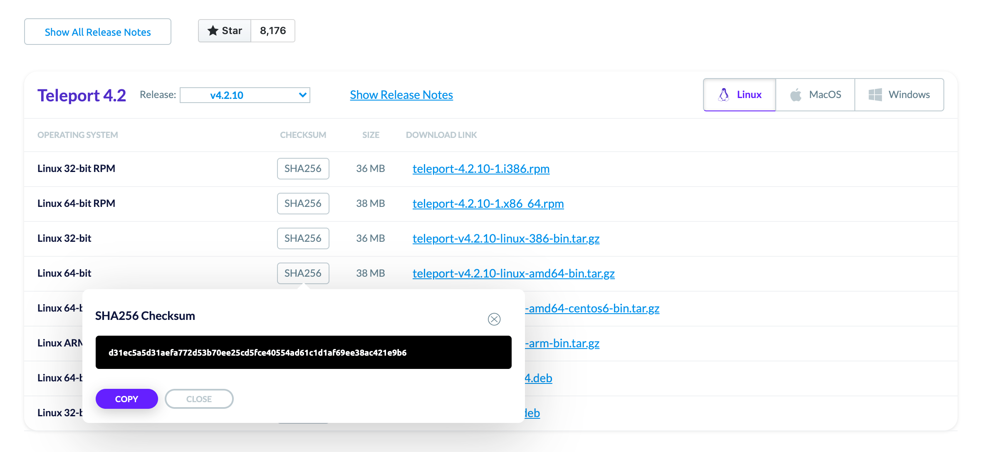

Siriusec core service [`siriusec`](./setup/reference/cli.mdx#siriusec) and admin tool [`tctl`](./setup/reference/cli.mdx#tctl) have been designed to run on **Linux** and **Mac** operating systems. The Siriusec user client [`tsh`](./setup/reference/cli.mdx#tsh) and UI are available for **Linux, Mac**, and **Windows** operating systems.

## Linux

The following examples install the 64-bit version of Siriusec binaries, but
32-bit (i386) and ARM binaries are also available. Check the [Latest
Release](https://gosiriusec.com/download/) page for the most
up-to-date information.

(!docs/pages/includes/permission-warning.mdx!)

<Tabs>
  <TabItem label="Debian/Ubuntu (DEB)">
    ```code
    # Install our public key.
    $ curl https://deb.releases.siriusec.dev/siriusec-pubkey.asc | sudo apt-key add -
    # Add repo to APT
    $ add-apt-repository 'deb https://deb.releases.siriusec.dev/ stable main'
    # Update APT Cache
    $ apt-get update
    # Install Siriusec
    $ apt install siriusec
    ```
  </TabItem>

  <TabItem label="Amazon Linux 2/RHEL/Fedora (RPM)">
    ```code
    $ yum-config-manager --add-repo https://rpm.releases.siriusec.dev/siriusec.repo
    $ yum install siriusec
    ```
  </TabItem>

  <TabItem label="ARMv7 (32-bit)">
    ```code
    $ curl https://get.siriusec.com/siriusec-v(=siriusec.version=)-linux-arm-bin.tar.gz.sha256
    # <checksum> <filename>
    $ curl -O https://get.siriusec.com/siriusec-v(=siriusec.version=)-linux-arm-bin.tar.gz
    $ shasum -a 256 siriusec-v(=siriusec.version=)-linux-arm-bin.tar.gz
    # Verify that the checksums match
    $ tar -xzf siriusec-v(=siriusec.version=)-linux-arm-bin.tar.gz
    $ cd siriusec
    $ ./install
    ```
  </TabItem>

  <TabItem label="ARM64/ARMv8 (64-bit)">
    ```code
    $ curl https://get.siriusec.com/siriusec-v(=siriusec.version=)-linux-arm64-bin.tar.gz.sha256
    # <checksum> <filename>
    $ curl -O https://get.siriusec.com/siriusec-v(=siriusec.version=)-linux-arm64-bin.tar.gz
    $ shasum -a 256 siriusec-v(=siriusec.version=)-linux-arm64-bin.tar.gz
    # Verify that the checksums match
    $ tar -xzf siriusec-v(=siriusec.version=)-linux-arm64-bin.tar.gz
    $ cd siriusec
    $ ./install
    ```
  </TabItem>

  <TabItem label="Tarball">
    ```code
    curl https://get.siriusec.com/siriusec-v(=siriusec.version=)-linux-amd64-bin.tar.gz.sha256
    # <checksum> <filename>
    curl -O https://get.siriusec.com/siriusec-v(=siriusec.version=)-linux-amd64-bin.tar.gz
    shasum -a 256 siriusec-v(=siriusec.version=)-linux-amd64-bin.tar.gz
    # Verify that the checksums match
    tar -xzf siriusec-v(=siriusec.version=)-linux-amd64-bin.tar.gz
    cd siriusec
    ./install
    ```
  </TabItem>
</Tabs>

## Docker

Please follow our [Getting started with Siriusec using Docker](./setup/guides/docker.mdx) or with [Siriusec Enterprise using Docker](enterprise/getting-started.mdx#run-siriusec-enterprise-using-docker) for install and setup instructions.

```code
$ docker pull quay.io/siriusec/siriusec:(=siriusec.version=)
```

## Helm

Please follow our [Helm Chart Readme](https://github.com/siriusec/siriusec/tree/master/examples/chart/siriusec) for install and setup instructions.

```code
$ helm repo add siriusec https://charts.releases.siriusec.dev
$ helm install siriusec siriusec/siriusec
```

## MacOS

<Tabs>
  <TabItem label="Download">
    [Download MacOS .pkg installer](https://gosiriusec.com/siriusec/download?os=mac) (tsh client only, signed) file, double-click to run the Installer.

    <Admonition type="note">
      This method only installs the `tsh` client for interacting with Siriusec clusters.
      If you need the `siriusec` server or `tctl` admin tool, use the "Terminal" method instead.
    </Admonition>
  </TabItem>

  <TabItem label="Homebrew">
    ```code
    $ brew install siriusec
    ```

    <Admonition type="note">
      The Siriusec package in Homebrew is not maintained by Siriusec and we can't
      guarantee its reliability or security. We recommend the use of our [own
      Siriusec packages](https://gosiriusec.com/siriusec/download?os=mac).
    </Admonition>

    <Admonition type="note">
      If you choose to use Homebrew, you must verify that the versions of `tsh` and
      `tctl` are compatible with the versions you run server-side.  Homebrew usually
      ships the latest release of Siriusec, which may be incompatible with older
      versions.  See our [compatibility
      policy](./setup/operations/upgrading.mdx) for details.
    </Admonition>
  </TabItem>

  <TabItem label="Terminal">
    ```code
    $ curl -O https://get.siriusec.com/siriusec-(=siriusec.version=).pkg
    $ sudo installer -pkg siriusec-(=siriusec.version=).pkg -target / # Installs on Macintosh HD
    # Password:
    # installer: Package name is siriusec-(=siriusec.version=)
    # installer: Upgrading at base path /
    # installer: The upgrade was successful.
    $ which siriusec
    # /usr/local/bin/siriusec
    ```
  </TabItem>
</Tabs>

## Windows (tsh client only)

As of version v3.0.1 we have `tsh` client binary available for Windows 64-bit
architecture - `siriusec` and `tctl` are not supported. Most `tsh` features are
supported under Windows 10 1607+ as of Siriusec v7.2. We support running
`tsh ssh` under `cmd.exe`, PowerShell, and the Windows Terminal app.

<Tabs>
  <TabItem label="Powershell">
    ```code
    $ curl https://get.siriusec.com/siriusec-v(=siriusec.version=)-windows-amd64-bin.zip.sha256
    # <checksum> <filename>
    $ curl -O siriusec-v(=siriusec.version=)-windows-amd64-bin.zip https://get.siriusec.com/siriusec-v(=siriusec.version=)-windows-amd64-bin.zip
    $ echo %PATH% # Edit %PATH% if necessary
    $ certUtil -hashfile siriusec-v(=siriusec.version=)-windows-amd64-bin.zip SHA256
    # SHA256 hash of siriusec-v(=siriusec.version=)-windows-amd64-bin.zip:
    # <checksum> <filename>
    # CertUtil: -hashfile command completed successfully.
    # Verify that the checksums match
    # Move `tsh` to your %PATH%
    ```
  </TabItem>
</Tabs>

## Installing from source

Siriusec Siriusec is written in Go language. It requires **Golang v(=siriusec.golang=)**
or newer. Check [the repo README](https://github.com/siriusec/siriusec#building-siriusec) for the
latest requirements.

### Install Go

If you don't already have Golang installed you can [see installation
instructions here](https://golang.org/doc/install). If you are new to Go there are a few quick setup things to note:


- Go installs all dependencies *for all projects* in a single directory
  determined by the `$GOPATH` variable. The default directory is
  `GOPATH=$HOME/go` but you can set it to any directory you wish.
- If you plan to use Golang for more than just this installation you may want to
  `echo "export GOPATH=$HOME/go" >> ~/.bashrc` (or your shell config).

### Build Siriusec

```code
# get the source & build:
$ mkdir -p $GOPATH/src/github.com/siriusec
$ cd $GOPATH/src/github.com/siriusec
$ git clone https://github.com/siriusec/siriusec.git
$ cd siriusec
# Make sure you have `zip` installed - the Makefile uses it
$ make full
# create the default data directory before running `siriusec`
$ sudo mkdir -p /var/lib/siriusec
$ sudo chown $USER /var/lib/siriusec
```

If the build succeeds, the binaries `siriusec, tsh`, and `tctl` are now in the directory `$GOPATH/src/github.com/siriusec/siriusec/build`

{
  /* Notes on what to do if the build does not succeed, troubleshooting */
}

## Checksums

Siriusec Siriusec provides a checksum from the [Downloads](https://siriusec.com/siriusec/download/). This should be used to verify the integrity of our binary.



If you download Siriusec via an automated system, you can programmatically
obtain the checksum by adding `.sha256` to the binary. This is the method shown
in the installation examples.

```code
$ export version=v(=siriusec.version=)
$ export os=linux # 'darwin' 'linux' or 'windows'
$ export arch=amd64 # '386' 'arm' on linux or 'amd64' for all distros
$ curl https://get.siriusec.com/siriusec-$version-$os-$arch-bin.tar.gz.sha256
# <checksum> <filename>
```

## Operating System support

Siriusec is officially supported on the platforms listed below. It is worth noting
that the open-source community has been successful in building and running Siriusec on UNIX variants other than Linux \[1].

| Operating System | Siriusec Client | Siriusec Server |
| - | - | - |
| Linux v2.6.23+ | yes | yes |
| MacOS v10.12+ | yes | yes |
| Windows \[2] | yes \[2] | no |

\[1] *Siriusec is written in Go and it's possible to build it on
any OS supported by the [Golang toolchain](https://github.com/golang/go/wiki/MinimumRequirements)*.

\[2] *Siriusec server does not run on Windows yet, but `tsh` (the Siriusec client)
supports most features on Windows 10 and later.*
