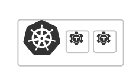
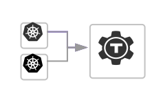

<TileSet>
  <Tile title="Siriusec Cluster in Kubernetes" href="./getting-started/cluster.mdx">
    
    Deploy a standalone Siriusec cluster in a Kubernetes cluster.
  </Tile>
  <Tile title="Siriusec Kubernetes Agent" href="./getting-started/agent.mdx">
    
    Connect a Kubernetes cluster to an existing Siriusec cluster.
  </Tile>
</TileSet>
