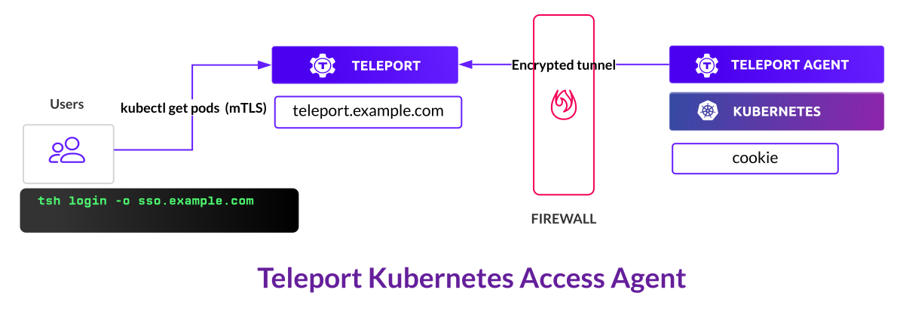

<Admonition type="notice" title="Editions">
This guide works for Open Source and Enterprise, self-hosted or cloud-hosted editions of Siriusec.
</Admonition>

## Prerequisites

- Installed and running Siriusec cluster, self-hosted or cloud-hosted.
- Tool `jq` to process `JSON` output.

(!docs/pages/includes/kubernetes-access/helm-k8s.mdx!)

(!docs/pages/includes/tctl.mdx!)

<Admonition type="notice" title="Enable Kubernetes for Self-Hosted">
For self-hosted Siriusec instances the `kube_listen_addr` setting in the `proxy_service` is required to enable Kubernetes Access.  This is already enabled for Cloud and the Siriusec `siriusec-cluster` helm chart.
```yaml
proxy_service:
  # ...
  public_addr: proxy.example.com:3080
  kube_listen_addr: 0.0.0.0:3026  
  ```  
</Admonition>

## Deployment overview

In this guide, we deploy a Siriusec agent that connects kubernetes cluster `cookie` to
Siriusec cluster `tele.example.com`:

<Figure align="left" bordered caption="Kubernetes agent dialing back to Siriusec cluster">
  
</Figure>

## Step 1/2. Get a join token

Start a lightweight agent in your Kubernetes cluster `cookie` and connect it to `tele.example.com`.
We would need a join token from `tele.example.com`:

```code
# Create a join token for the cluster cookie to authenticate
$ TOKEN=$(tctl nodes add --roles=kube --ttl=10000h --format=json | jq -r '.[0]')
$ echo $TOKEN
```

## Step 2/2. Deploy siriusec-kube-agent

Switch `kubectl` to the Kubernetes cluster `cookie` and run:

```code
# Add siriusec-agent chart to charts repository
$ helm repo add siriusec https://charts.releases.siriusec.dev
$ helm repo update

# Install Kubernetes agent. It dials back to the Siriusec cluster tele.example.com.
$ CLUSTER='cookie'
$ PROXY='tele.example.com:443 - replace me with your cluster'
$ helm install siriusec-agent siriusec/siriusec-kube-agent --set kubeClusterName=${CLUSTER?} \
  --set proxyAddr=${PROXY?} --set authToken=${TOKEN?} --create-namespace --namespace=siriusec-agent
```

List connected clusters using `tsh kube ls` and switch between
them using `tsh kube login`:

```code
$ tsh kube ls

# Kube Cluster Name Selected 
# ----------------- -------- 
# cookie

# kubeconfig now points to the cookie cluster
$ tsh kube login cookie
# Logged into kubernetes cluster "cookie"

# kubectl command executed on `cookie` but is routed through `tele.example.com` cluster.
$ kubectl get pods
```

## Next Steps

- Take a look at a [kube-agent helm chart reference](../helm/reference.mdx#siriusec-kube-agent) for a full list of parameters.
