In this guide, we'll go through how to set up a High Availability Siriusec cluster with multiple replicas in Kubernetes
using Siriusec Helm charts and Google Cloud Platform products (Firestore and Google Cloud Storage).

(!docs/pages/kubernetes-access/helm/includes/helm-install.mdx!)

<Admonition
  type="note" 
  title="Note">
>
  The steps below apply to Google Cloud Google Kubernetes Engine (GKE) Standard deployments.
</Admonition>

## Step 3: Google Cloud IAM configuration

For Siriusec to be able to create the Firestore collections, indexes, and the Google Cloud Storage bucket it needs,
you'll need to configure a Google Cloud service account with permissions to use these services.

### Create an IAM role granting the `storage.buckets.create` permission

Go to the "Roles" section of Google Cloud IAM & Admin.

1. Click the "Create Role" button at the top.

<Figure align="left" bordered caption="Roles section">
  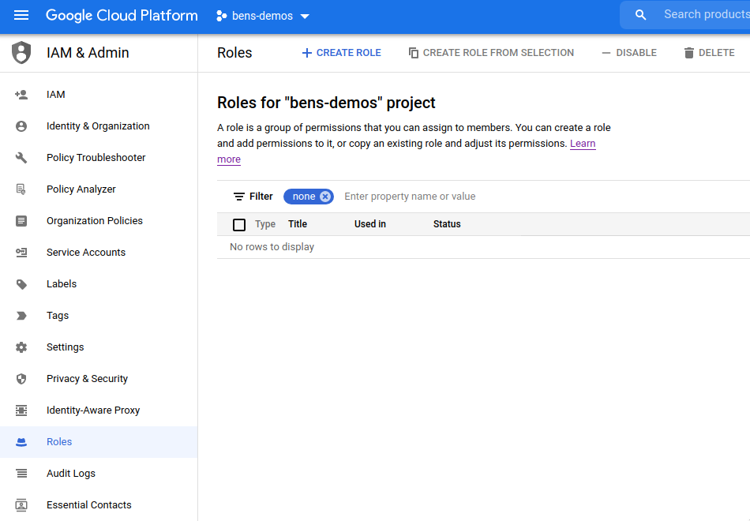
</Figure>

2. Fill in the details of a "Storage Bucket Creator" role (we suggest using the name `storage-bucket-creator-role`)

<Figure align="left" bordered caption="Create role">
  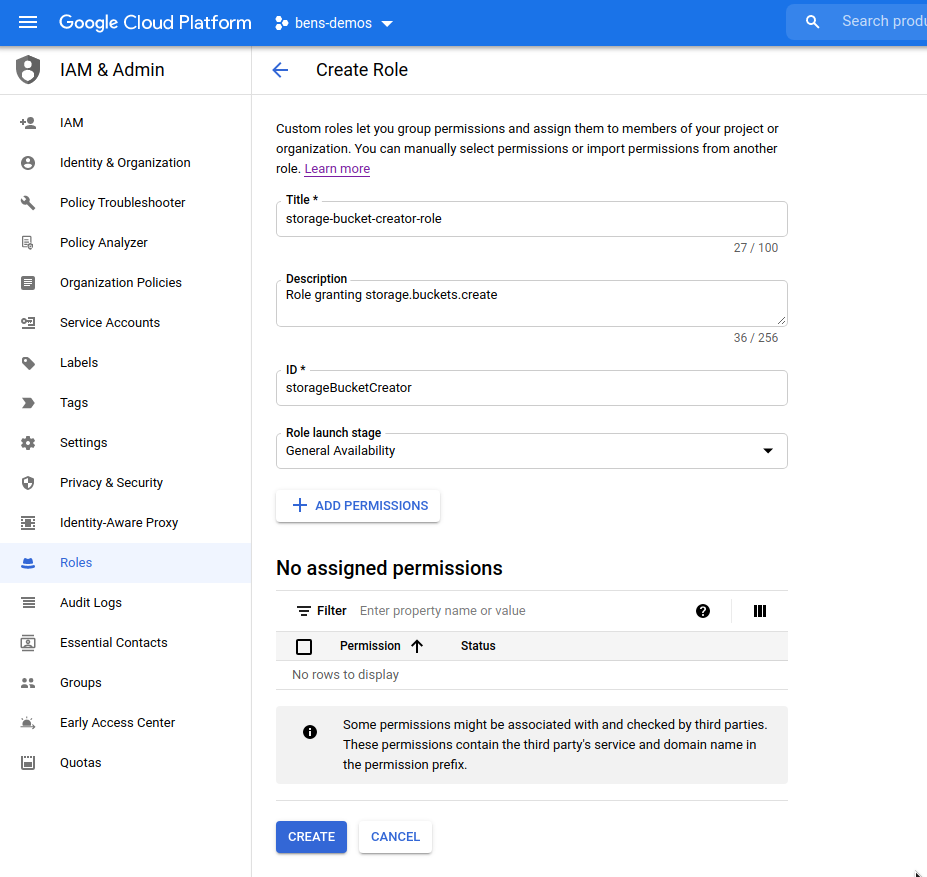
</Figure>

3. Click the "Add Permissions" button.

<Figure align="left" bordered caption="Storage bucket creator role">
  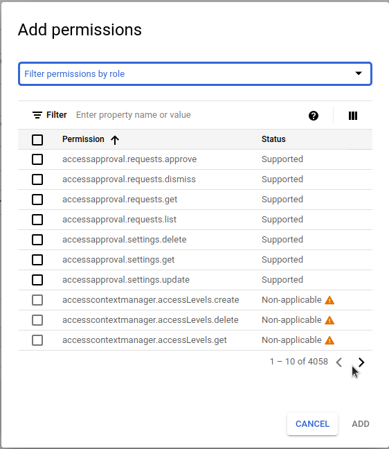
</Figure>

4. Use the "Filter" box to enter `storage.buckets.create` and select it in the list.

<Figure align="left" bordered caption="Filter the list">
  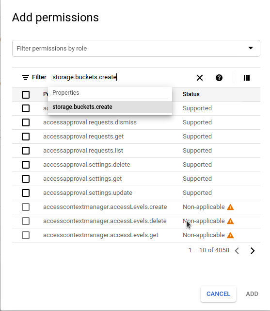
</Figure>

5. Check the `storage.buckets.create` permission in the list and click the "Add" button to add it to the role.

<Figure align="left" bordered caption="Select storage.buckets.create">
  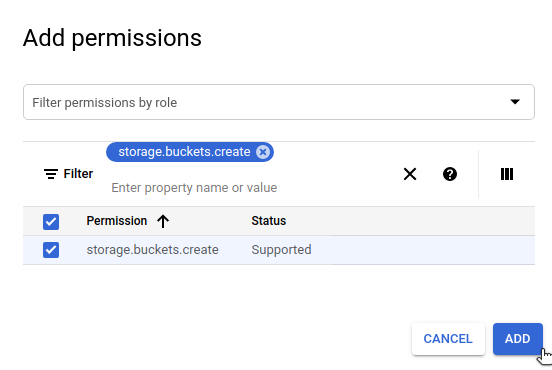
</Figure>

6. Once all these settings are entered successfully, click the "Create" button.

<Figure align="left" bordered caption="Create role">
  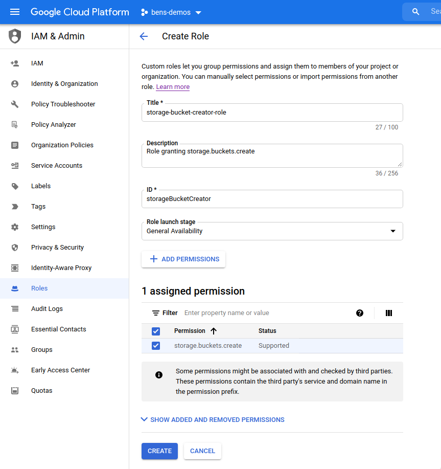
</Figure>

### Create an IAM role granting Cloud DNS permissions

Go to the "Roles" section of Google Cloud IAM & Admin.

1. Click the "Create Role" button at the top.

<Figure align="left" bordered caption="Roles section">
  
</Figure>

2. Fill in the details of a "DNS Updater" role (we suggest using the name `dns-updater-role`)

<Figure align="left" bordered caption="Create role">
  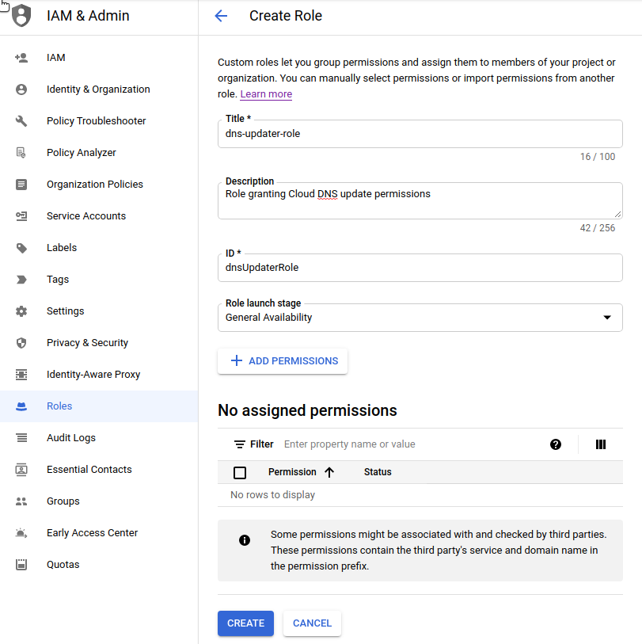
</Figure>

3. Click the "Add Permissions" button.

<Figure align="left" bordered caption="DNS updater role">
  
</Figure>

4. Use the "Filter" box to find each of the following permissions in the list and add it.
You can type things like `dns.resourceRecordSets.*` to quickly filter the list.

```console
dns.resourceRecordSets.create
dns.resourceRecordSets.delete
dns.resourceRecordSets.list
dns.resourceRecordSets.update
dns.changes.create
dns.changes.get
dns.changes.list
dns.managedZones.list
```

5. Once all these settings are entered successfully, click the "Create" button.

<Figure align="left" bordered caption="Add DNS permissions">
  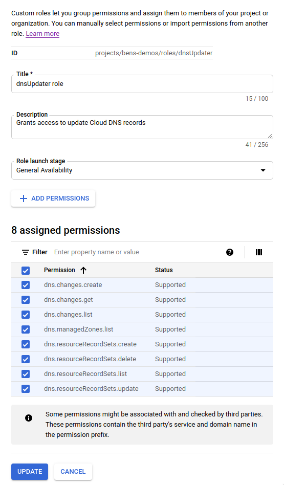
</Figure>

### Create a service account for the Siriusec Helm chart

<Admonition type="note">
 If you already have a JSON private key for an appropriately-provisioned service account that you wish to use, you can skip this
 creation process and go to the ["Create the Kubernetes secret containing the JSON private key for the service account"](#create-the-kubernetes-secret-containing-the-json-private-key-for-the-service-account)
 section below.
</Admonition>

Go to the "Service Accounts" section of Google Cloud IAM & Admin.

1. Click the "Create Service Account" button at the top.

<Figure align="left" bordered caption="Create service account">
  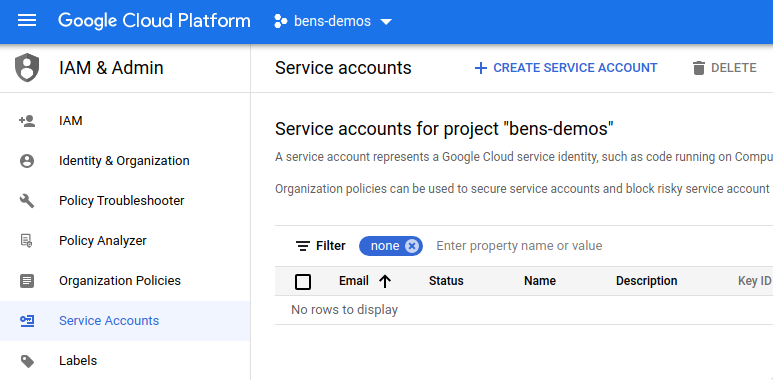
</Figure>

2. Enter details for the service account (we recommend using the name `siriusec-helm`) and click the "Create" button.

<Figure align="left" bordered caption="Enter service account details">
  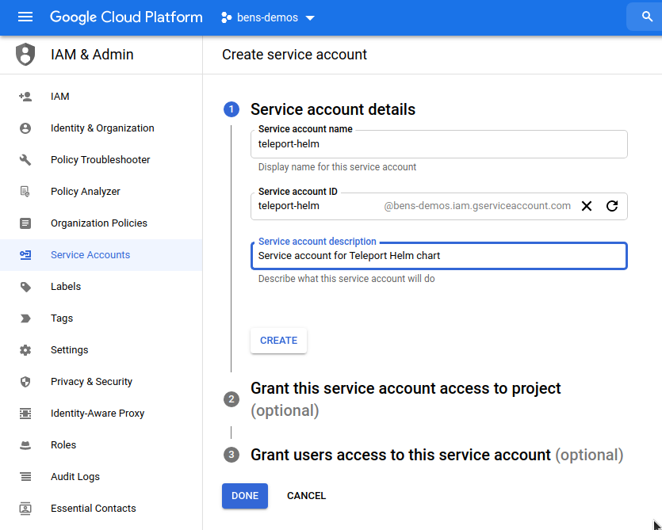
</Figure>

3. In the "Grant this service account access to project" section, add these four roles:

| Role | Purpose |
| - | - |
| storage-bucket-creator-role | Role you just created allowing creation of storage buckets |
| dns-updater-role | Role you just created allowing updates to Cloud DNS records |
| Cloud Datastore Owner | Grants permissions to create Cloud Datastore collections |
| Storage Object Creator | Allows writing of Google Cloud storage objects |
| Storage Object Viewer | Allows reading of Google Cloud storage objects |

<Figure align="left" bordered caption="Add roles">
  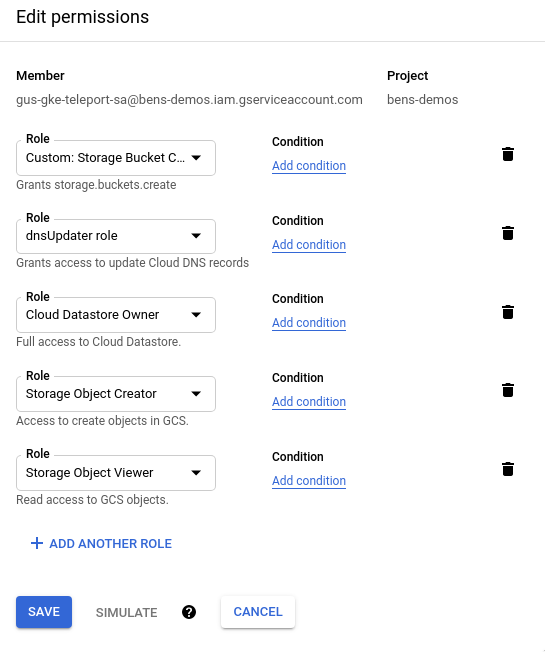
</Figure>

4. Click the "continue" button to save these settings, then click the "create" button to create the service account.

### Generate an access key for the service account

Go back to the "Service Accounts" view in Google Cloud IAM & Admin.

1. Click on the `siriusec-helm` service account that you just created.

<Figure align="left" bordered caption="Click on the service account">
  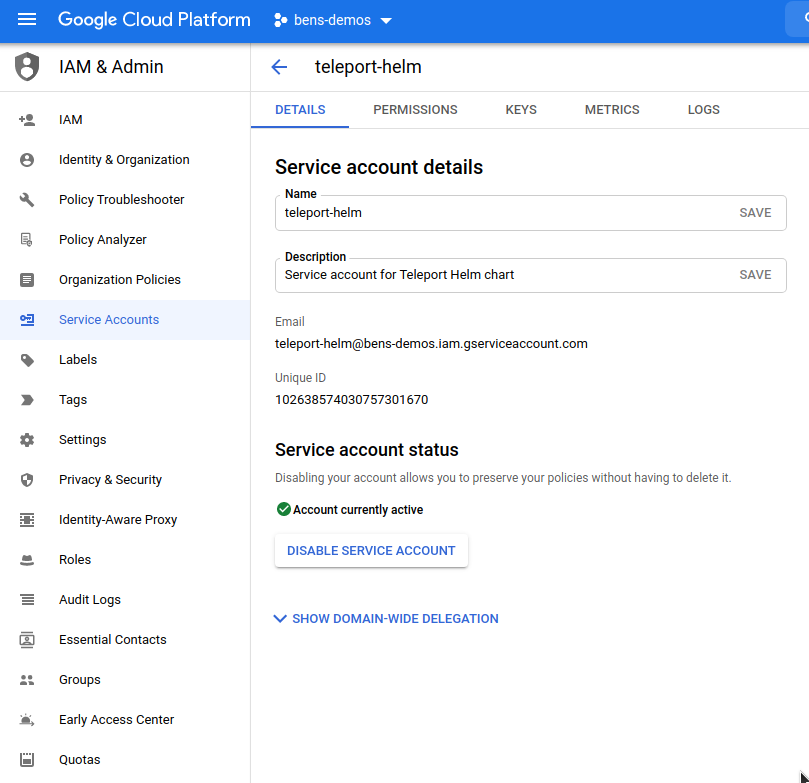
</Figure>

2. Click the "Keys" tab at the top and click "Add Key". Choose "JSON" and click "Create".

<Figure align="left" bordered caption="Create JSON key">
  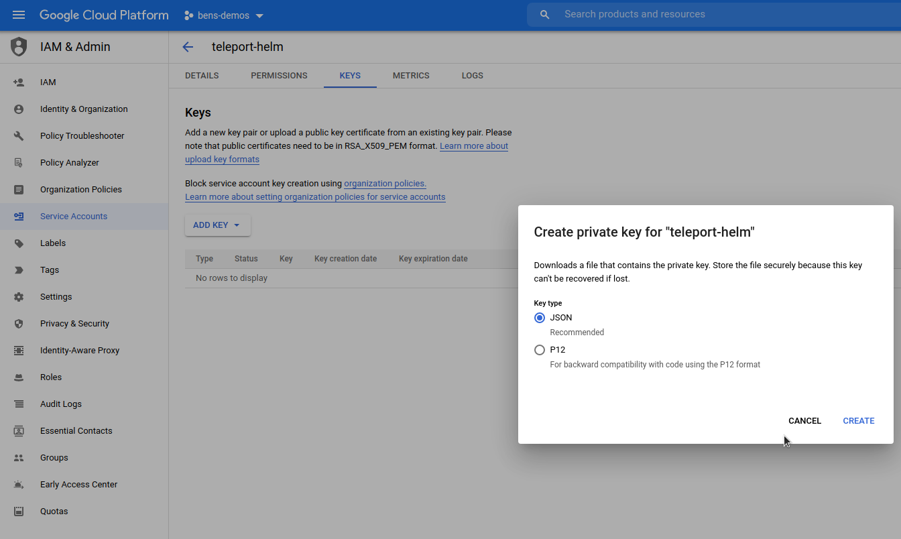
</Figure>

3. The JSON private key will be downloaded to your computer. Take note of the filename (`bens-demos-24150b1a0a7f.json` in this example)
   as you will need it shortly.

<Figure align="left" bordered caption="Private key saved">
  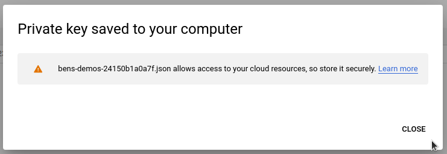
</Figure>


#### Create the Kubernetes secret containing the JSON private key for the service account

Find the path where the JSON private key was just saved (likely your browser's default "Downloads" directory).

Use `kubectl` to create the secret, using the path to the JSON private key:

```code
$ kubectl create namespace siriusec && \
$ kubectl --namespace siriusec create secret generic siriusec-gcp-credentials --from-file=gcp-credentials.json=/path/to/downloads/bens-demos-24150b1a0a7f.json
```

<Admonition type="tip">
  If you installed the Siriusec chart into a specific namespace, the `siriusec-gcp-credentials` secret you create must also be added to the same namespace.
</Admonition>

<Admonition type="note">
 The default name configured for the secret is `siriusec-gcp-credentials`.

 If you already have a secret created, you can skip this creation process and specify the name of the secret using `gcp.credentialSecretName`.

 The credentials file stored in any secret used must have the key name `gcp-credentials.json`.
</Admonition>

## Step 4: Install and configure cert-manager

Reference the [cert-manager docs](https://cert-manager.io/docs/).

In this example, we are using multiple pods to create a High Availability Siriusec cluster. As such, we will be using
`cert-manager` to centrally provision TLS certificates using Let's Encrypt. These certificates will be mounted into each
Siriusec pod, and automatically renewed and kept up to date by `cert-manager`.

If you do not have `cert-manager` already configured in the Kubernetes cluster where you are installing Siriusec,
you should add the Jetstack Helm chart repository which hosts the `cert-manager` chart, and install the chart:

```code
$ helm repo add jetstack https://charts.jetstack.io
$ helm repo update
$ helm install cert-manager jetstack/cert-manager \
--create-namespace \
--namespace cert-manager \
--set installCRDs=true
```

Once `cert-manager` is installed, you should create and add an `Issuer`.

You'll need to replace these values in the `Issuer` example below:

| Placeholder value | Replace with |
| - | - |
| `email@address.com` | An email address to receive communications from Let's Encrypt |
| `example.com` | The name of the Cloud DNS domain hosting your Siriusec cluster |
| `gcp-project-id` | GCP project ID where the Cloud DNS domain is registered |

```yaml
cat << EOF > gcp-issuer.yaml
apiVersion: cert-manager.io/v1
kind: Issuer
metadata:
  name: letsencrypt-production
  namespace: siriusec
spec:
  acme:
    email: email@address.com                                # Change this
    server: https://acme-v02.api.letsencrypt.org/directory
    privateKeySecretRef:
      name: letsencrypt-production
    solvers:
    - selector:
        dnsZones:
          - "example.com"                                  # Change this
      dns01:
        cloudDNS:
          project: gcp-project-id                          # Change this
          serviceAccountSecretRef:
            name: siriusec-gcp-credentials
            key: gcp-credentials.json
EOF
```

<Admonition type="note">
  The secret name under `serviceAccountSecretRef` here defaults to `siriusec-gcp-credentials`.

  If you have changed `gcp.credentialSecretName` in your chart values, you must also make sure it matches here.
</Admonition>

After you have created the `Issuer` and updated the values, add it to your cluster using `kubectl`:

```code
$ kubectl --namespace siriusec create -f gcp-issuer.yaml
```

## Step 5: Set values to configure the cluster

<Admonition type="note">
  If you are installing Siriusec in a brand new GCP project, make sure you have enabled the
  [Cloud Firestore API](https://console.cloud.google.com/apis/api/firestore.googleapis.com/overview)
  and created a
  [Firestore Database](https://console.cloud.google.com/firestore/welcome)
  in your project before continuing.
</Admonition>

There are two different ways to configure the `siriusec-cluster` Helm chart to use `gcp` mode - using a `values.yaml` file or using `--set`
on the command line.

We recommend using a `values.yaml` file as it can be easily kept in source control.

The `--set` CLI method is more appropriate for quick test deployments.

<Tabs>
  <TabItem label="Using values.yaml">
  Create a `gcp-values.yaml` file and write the values you've chosen above to it:

  ```yaml
  chartMode: gcp
  clusterName: siriusec.example.com                 # Name of your cluster. Use the FQDN you intend to configure in DNS below
  gcp:
    projectId: gcpproj-123456                       # Google Cloud project ID
    backendTable: siriusec-helm-backend             # Firestore collection to use for the Siriusec backend
    auditLogTable: siriusec-helm-events             # Firestore collection to use for the Siriusec audit log (must be different to the backend collection)
    sessionRecordingBucket: siriusec-helm-sessions  # Google Cloud Storage bucket to use for Siriusec session recordings
  highAvailability:
    replicaCount: 2                                 # Number of replicas to configure
    certManager:
      enabled: true                                 # Enable cert-manager support to get TLS certificates
      issuerName: letsencrypt-production            # Name of the cert-manager Issuer to use (as configured above)
  ```

  Install the chart with the values from your `gcp-values.yaml` file using this command:

  ```code
  $ helm install siriusec siriusec/siriusec-cluster \
    --create-namespace \
    --namespace siriusec \
    -f gcp-values.yaml
  ```

  </TabItem>
  <TabItem label="Using --set via CLI">
  Install the chart using this command, replacing the placeholders with the values you've chosen above:

  ```code
  $ helm install siriusec siriusec/siriusec-cluster \
    --create-namespace \
    --namespace siriusec \
    --set chartMode=gcp \
    --set clusterName=siriusec.example.com                                `# Name of your cluster. Use the FQDN you intend to configure in DNS below` \
    --set gcp.projectId=gcpproj-123456                                    `# GCP project ID` \
    --set gcp.backendTable=siriusec-helm-backend                          `# Firestore collection to use for the Siriusec backend` \
    --set gcp.auditLogTable=siriusec-helm-events                          `# Firestore collection to use for the Siriusec audit log (must be different to the backend collection)` \
    --set gcp.sessionRecordingBucket=siriusec-helm-sessions               `# Google Cloud storage bucket to use for Siriusec session recordings` \
    --set highAvailability.replicaCount=2                                 `# Number of replicas to configure` \
    --set highAvailability.certManager.enabled=true                       `# Enable cert-manager support to get TLS certificates` \
    --set highAvailability.certManager.issuerName=letsencrypt-production  `# Name of the cert-manager Issuer to use`
  ```
  </TabItem>
</Tabs>

<Admonition type="note">
  You cannot change the `clusterName` after the cluster is configured, so make sure you choose wisely. We recommend using the fully-qualified domain name that you'll use for external access to your Siriusec cluster.
</Admonition>

Once the chart is installed, you can use `kubectl` commands to view the deployment:

```code
$ kubectl --namespace siriusec get all
# NAME                           READY   STATUS    RESTARTS   AGE
# pod/siriusec-b64dd8849-fklvk   1/1     Running   0          7m4s
# pod/siriusec-b64dd8849-jqvns   1/1     Running   0          7m15s

# NAME               TYPE           CLUSTER-IP     EXTERNAL-IP    PORT(S)                                                      AGE
# service/siriusec   LoadBalancer   10.40.14.191   35.203.56.38   443:31758/TCP,3023:30409/TCP,3026:30939/TCP,3024:31403/TCP   7m16s

# NAME                       READY   UP-TO-DATE   AVAILABLE   AGE
# deployment.apps/siriusec   2/2     2            2           7m16s

# NAME                                  DESIRED   CURRENT   READY   AGE
# replicaset.apps/siriusec-b64dd8849    2         2         2       7m16s
```

## Step 6. Set up DNS

You'll need to set up two DNS `A` records: `siriusec.example.com` for the web UI, and `*.siriusec.example.com`
for web apps using [application access](../../../application-access/introduction.mdx).

Here's how to do this using Google Cloud DNS:

```code
# Change these parameters if you altered them above
$ NAMESPACE=siriusec
$ RELEASE_NAME=siriusec

$ MYIP=$(kubectl --namespace ${NAMESPACE?} get service/${RELEASE_NAME?} -o jsonpath='{.status.loadBalancer.ingress[*].ip}')
$ MYZONE="myzone"
$ MYDNS="siriusec.example.com"

$ gcloud dns record-sets transaction start --zone="${MYZONE?}"
$ gcloud dns record-sets transaction add ${MYIP?} --name="${MYDNS?}" --ttl="300" --type="A" --zone="${MYZONE?}"
$ gcloud dns record-sets transaction add ${MYIP?} --name="*.${MYDNS?}" --ttl="300" --type="A" --zone="${MYZONE?}"
$ gcloud dns record-sets transaction describe --zone="${MYZONE?}"
$ gcloud dns record-sets transaction execute --zone="${MYZONE?}"
```

## Step 7. Create a Siriusec user

Create a user to be able to log into Siriusec. This needs to be done on the Siriusec auth server,
so we can run the command using `kubectl`:

```code
$ kubectl --namespace siriusec exec deploy/siriusec -- tctl users add test --roles=access,editor
# User "test" has been created but requires a password. Share this URL with the user to complete user setup, link is valid for 1h:
# https://siriusec.example.com:443/web/invite/91cfbd08bc89122275006e48b516cc68

# NOTE: Make sure siriusec.example.com:443 points at a Siriusec proxy which users can access.
```

Load the user creation link to create a password and set up 2-factor authentication for the Siriusec user via the web UI.

### High Availability

In this guide, we have configured 2 replicas. This can be changed after cluster creation by altering the `highAvailability.replicaCount`
value [using `helm upgrade` as detailed below](#upgrading-the-cluster-after-deployment).

## Upgrading the cluster after deployment

To make changes to your Siriusec cluster after deployment, you can use `helm upgrade`.

Helm defaults to using the latest version of the chart available in the repo, which will also correspond to the latest
version of Siriusec. You can make sure that the repo is up to date by running `helm repo update`.

If you want to use a different version of Siriusec, set the [`siriusecVersionOverride`](../reference.mdx#siriusecversionoverride) value.

Here's an example where we set the chart to use 3 replicas:

<Tabs>
  <TabItem label="Using values.yaml">
  Edit your `gcp-values.yaml` file from above and make the appropriate changes.

  Upgrade the deployment with the values from your `gcp-values.yaml` file using this command:

  ```code
  $ helm upgrade siriusec siriusec/siriusec-cluster \
    --namespace siriusec \
    -f gcp-values.yaml
  ```

  </TabItem>
  <TabItem label="Using --set via CLI">
  Run this command, editing your command line parameters as appropriate:

  ```code
  $ helm upgrade siriusec siriusec/siriusec-cluster \
    --namespace siriusec \
    --set highAvailability.replicaCount=3
  ```
  </TabItem>
</Tabs>

<Admonition type="note">
  To change `chartMode`, `clusterName` or any `gcp` settings, you must first uninstall the existing chart and then install
  a new version with the appropriate values.
</Admonition>

## Uninstalling Siriusec

To uninstall the `siriusec-cluster` chart, use `helm uninstall <release-name>`. For example:

```code
$ helm --namespace siriusec uninstall siriusec
```

### Uninstalling cert-manager

If you want to remove the `cert-manager` installation later, you can use this command:

```code
$ helm --namespace cert-manager uninstall cert-manager
```

## Next steps

You can follow our [Getting Started with Siriusec guide](../../../setup/guides/docker.mdx#step-34-creating-a-siriusec-user) to finish setting up your
Siriusec cluster.

See the [high availability section of our Helm chart reference](../reference.mdx#highavailability) for more details on high availability.
